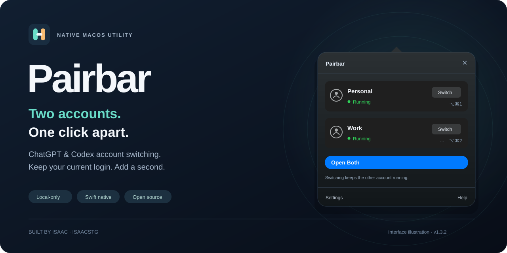
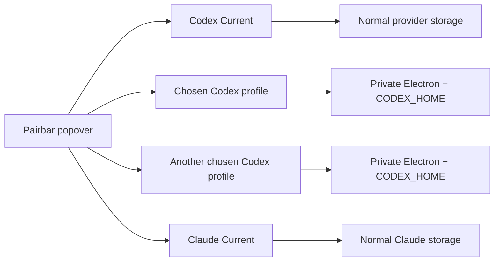

<p align="center">
  
</p>

# Pairbar · account profiles for ChatGPT/Codex on macOS

**Keep each provider's normal Current account. Save additional Codex profiles. Open only the ones you choose.**

[](https://github.com/isaacstg/pairbar-codex/actions/workflows/ci.yml) [](#build-and-try-it) [](Package.swift) [](LICENSE)

Pairbar is a native, local-only menu-bar utility for the official macOS apps. Pairbar 2 keeps one ordinary **Current** account per provider and lets you save any number of additional **ChatGPT/Codex profiles**. It imposes no profile-count limit, but it never opens every saved profile automatically: you choose what to open, and memory-pressure warnings pause unsafe automatic openings.

Each additional Codex profile gets its own Electron storage and `CODEX_HOME`. Pairbar does not swap tokens, copy sessions, read credentials, or modify the official app. It is an independent, unofficial project and is not affiliated with or endorsed by OpenAI or Anthropic.

**[Build and try it](#build-and-try-it) · [User guide](docs/USER_GUIDE.md) · [Security model](SECURITY.md) · [Engineering case study](docs/CASE_STUDY.md)**

> **Development status:** the Pairbar 2 source, automated suite, audit, and local packaging checks are complete in this branch. The archive is an ad-hoc development artifact; there is no Developer ID signed, notarized public Pairbar 2 release. Managed Claude profiles remain disabled until real signed-in tests prove that both Chat and Code are separated without account crossover. Cowork is also unvalidated. See [implementation status](docs/IMPLEMENTATION_STATUS.md).

## Everyday workflow

- Find profiles by name or filter the list by Codex or Claude.
- Keep frequently used profiles at the top with favorites.
- Open one profile, or select a specific group and open that group.
- Assign configurable global shortcuts to individual profiles.
- Opt individual profiles into opening at login only after enabling the separate global setting. Both settings are off by default.

Pairbar stays in a native popover. It has no permanent window and does not require a Dock icon. Profile creation, editing, ordering, shortcuts, lifecycle controls, diagnostics, recovery, export, and startup preferences remain inside the popover.

## Provider support

| Provider target | Current account | Additional managed profiles |
|---|---|---|
| ChatGPT/Codex | Opens or focuses the official app normally; Pairbar never closes, restarts, or resets it | Implemented with separate Electron storage and `CODEX_HOME`, compatibility approval, per-profile receipts, and conservative recovery |
| Claude.app | Opens or focuses the official app normally after verifying its official identity | **Disabled.** Static inspection is research evidence only; real Chat and Code isolation acceptance has not passed |
| Claude Cowork | Part of the normal Current app only | **Unvalidated.** Cloud, local VM, shared configuration, link routing, and credential boundaries still need explicit acceptance evidence |

“Current” is not a managed profile. It has no Pairbar storage directory or ownership receipt and never receives profile overrides. Pairbar will not use a managed process as Current when identity is uncertain.

## Safety properties

- **Verified ownership.** Managed lifecycle actions require a receipt matching profile, storage generation, PID, user, kernel start time, exact executable, provider identity, and expected private paths.
- **Conservative recovery.** Interrupted launches and unreadable or ambiguous processes block control. Pairbar never guesses ownership and never force-kills an app.
- **Durable intent.** Pairbar records a pending launch before asking LaunchServices to open a managed profile and clears it only after process and app-build checks succeed.
- **Recoverable reset.** Reset and removal archive the profile directory; they do not immediately delete it. Every official process for that provider must be closed before an archive transition.
- **Opaque migration.** Existing Current + Second installations migrate their Pairbar metadata while the contents of `Profiles/b` remain unread. The historical Second storage path is retained.
- **Redacted output.** Diagnostics contain Pairbar state and bounded event codes. Configuration export contains labels and preferences, never paths, receipts, PIDs, fingerprints, journals, account data, or credentials.
- **No switcher networking.** Pairbar contains no network client, telemetry, updater, credential reader, token copier, Keychain access, or inspection of another process's arguments or environment.

This is profile separation within one macOS user, not an operating-system security boundary. The official apps and their upstream behavior determine whether profile overrides provide real session separation. Pairbar therefore treats static compatibility checks as necessary evidence, never as proof of account isolation.

## Build and try it

You need macOS 13 or later, Xcode Command Line Tools with Swift 5.9 or later, and the official Electron-based `ChatGPT.app` with bundle identifier `com.openai.codex` for managed Codex profiles. The optional Claude Current integration expects the official `Claude.app` with bundle identifier `com.anthropic.claudefordesktop` and Team ID `Q6L2SF6YDW`.

```sh
git clone https://github.com/isaacstg/pairbar-codex.git
cd pairbar-codex
python3 scripts/audit.py
swift test
bash scripts/build.sh
```

Use a regular checkout location such as your home directory. Filesystem tests deliberately reject macOS symlink aliases such as `/tmp` and `/var`. The build script creates `dist/Pairbar.zip`; local archives are ad-hoc signed and must not be described as notarized releases. Do not disable Gatekeeper globally.

When upgrading from Codex Account Switcher or Pairbar 1.3.3, keep the existing application-support directory. Pairbar 2 migrates switcher-owned metadata and preserves the legacy Second directory without reading the profile inside it. Review the in-app migration/recovery state before opening a managed profile.

## How managed Codex profiles work



Only a chosen managed Codex profile receives `--user-data-dir`, `CODEX_ELECTRON_USER_DATA_PATH`, and `CODEX_HOME`. LaunchServices starts the official app unchanged with an allowlisted environment. Current receives no isolation override. Saved profiles consume metadata and storage but are not assumed to be simultaneously runnable; practical concurrency depends on memory and on the official app.

Before launch, Pairbar saves a profile-specific pending marker. After launch it verifies the returned process, saves a receipt, rechecks the approved app fingerprint, and then clears pending state. Any unreadable identity or mismatched state blocks focus, close, restart, archive, and recovery as appropriate.

Read the [security model](SECURITY.md) and [Claude acceptance protocol](docs/CLAUDE_ACCEPTANCE.md) for the exact boundaries.

## Repository structure

| Layer | Responsibility |
|---|---|
| `SwitcherCore/Dynamic` | Dynamic provider/profile model, schema-3 metadata, migration, receipts, state resolution, archive journal |
| `SwitcherCore/Providers/Claude` | Read-only static inspection and an explicit unsupported capability result for managed Claude profiles |
| AppKit / SwiftUI | Native popover, search, filters, favorites, configurable shortcuts, login choices, local feedback |
| Runtime controller | LaunchServices, process observations, ownership checks, memory pressure, and lifecycle orchestration |
| Tests and audit | Pure state/storage/compatibility tests, fake-runtime integration checks, source-policy guard, and packaging checks |

The audited Pairbar 2 tree passed 131 Swift tests, the source-policy audit, diff/plist/shell checks, release compilation, fresh extraction, and strict all-architectures signature verification. The resulting local arm64 Pairbar 2.0.0 (17) archive has SHA-256 `3fb1070595328e5ae6d296da77c75222fff50ce4e65d4aefce681ab6bd893c12`; it is ad-hoc signed with hardened runtime, not Developer ID signed or notarized.

The inert native preview was opened and inspected without constructing a controller, registering shortcuts, changing login items, or touching provider apps; its popover, Settings page, and accessibility labels were present. Read-only checks of the currently installed ChatGPT `26.915.31945 (9922)` and Claude `1.34493.1` both failed strict signature validation, so Pairbar correctly blocks them. An earlier ChatGPT check on the same reported version had passed, making this a local installation-integrity failure rather than current compatibility evidence. Smoke/live account work, login-item behavior, keyboard/VoiceOver acceptance, and signed-in isolation remain untested.

## Contributing

Read [CONTRIBUTING.md](CONTRIBUTING.md) before changing security-sensitive behavior. Report reproducible bugs through [GitHub issues](https://github.com/isaacstg/pairbar-codex/issues/new?template=bug_report.yml) and use [private vulnerability reporting](https://github.com/isaacstg/pairbar-codex/security/advisories/new) for security issues. Never include account data or credentials.

## Credits and license

Created by **[Isaac · isaacstg](https://github.com/isaacstg)**. The implementation is independent. Existing account switchers were studied for product patterns; reused code must be separately identified and attributed.

**MIT** · [License](LICENSE) · [Changelog](CHANGELOG.md)
