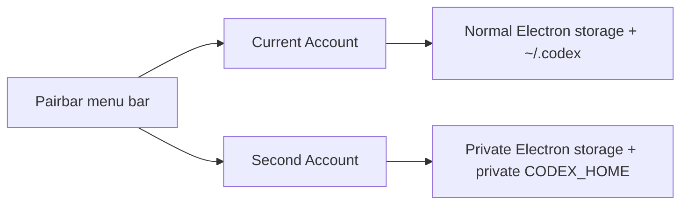

<p align="center">
  
</p>

# Pairbar · ChatGPT & Codex account switcher for macOS

**Keep your current account. Add a second. Switch from the menu bar.**

[](https://github.com/isaacstg/pairbar-codex/actions/workflows/ci.yml) [](#build-and-try-it) [](Package.swift) [](LICENSE)

Pairbar is a native, local-only utility that keeps **two official ChatGPT/Codex instances open simultaneously**. Your normal account keeps its existing login and storage. The second gets separate Electron storage and a private `CODEX_HOME`.

No token swapping, copied sessions, or modified OpenAI app. An independent, unofficial project; not affiliated with or endorsed by OpenAI.

**[Build & try it](#build-and-try-it) · [User guide](docs/USER_GUIDE.md) · [Security model](SECURITY.md) · [Engineering case study](docs/CASE_STUDY.md)**

> **Availability:** public source and ad-hoc personal-build CI artifacts. There is no notarized binary release yet. Read [validation status](VALIDATION.md) for performed checks and remaining acceptance work. The banner contains an interface illustration, not a screenshot.

## Three actions for everyday use

| Action | What happens |
|---|---|
| **⌥⌘1** | Open or focus your normal Current Account. |
| **⌥⌘2** | Open or focus your isolated Second Account. |
| **Open Both** | Open/focus both when ownership and compatibility checks permit. |

The native popover shows two named account cards and their status. Settings and Help stay in the same place. Second's quit/restart lives in a small More menu; diagnostics and recovery appear under Help.

## Why Pairbar?

- **Preserve the account you already use.** Current stays on ordinary storage and is never quit or restarted by the switcher.
- **Keep both accounts open.** Second uses its own Electron directory and Codex home; sign in separately once.
- **Control only what can be proven.** Second lifecycle actions require a receipt matching PID, user, process start time, executable, and expected private paths.
- **Handle uncertainty conservatively.** Interrupted launches and ambiguous processes block actions instead of guessing.
- **Review app updates explicitly.** A changed ChatGPT build needs a fresh check and confirmation before a new Second launch.
- **Audit a small implementation.** Swift/AppKit/SwiftUI, no third-party Swift package dependencies, no switcher networking or credential access, and a source-policy guard in CI.

This is profile separation under one macOS user, **not an OS security sandbox**. Static compatibility checks cannot prove session isolation. Verify the displayed account after sign-in or an app update. Details: [SECURITY.md](SECURITY.md).

## Build and try it

You need **macOS 13+**, **Xcode Command Line Tools / Swift 5.9+**, and the official **Electron-based `ChatGPT.app` with bundle ID `com.openai.codex`**. Other OpenAI desktop apps are not interchangeable. CI runs on macOS 14 and 15.

```sh
git clone https://github.com/isaacstg/pairbar-codex.git
cd pairbar-codex
python3 scripts/audit.py
swift test
bash scripts/build.sh
```

Use a regular checkout location, such as your home directory. Filesystem tests intentionally reject macOS symlink aliases such as `/tmp` and `/var`.

Extract `dist/Pairbar.zip` and put **Pairbar.app** in `/Applications` or `~/Applications`. When upgrading from Codex Account Switcher, quit only the old switcher and replace its app bundle. Keep the private data folder; the bundle identifier and storage root are unchanged. If startup at login was enabled, disable it before replacing the old app and enable it again from Pairbar's Settings. Local/CI archives are ad-hoc signed; do not disable Gatekeeper globally.

1. Open the switcher and click its two-person menu-bar icon.
2. Click **Set Up Second Account** after the official app check passes.
3. Sign into the intended second account in the new ChatGPT window. Your current login stays in place.
4. Use **⌥⌘1**, **⌥⌘2**, or **Open Both**. Rename the cards in Settings if you like.

[Full setup, update, recovery, reset, and uninstall guide →](docs/USER_GUIDE.md)

## How the separation works



Both processes run the official OpenAI app unchanged. Only Second receives `--user-data-dir`, `CODEX_ELECTRON_USER_DATA_PATH`, and `CODEX_HOME` overrides. LaunchServices creates it with an allowlisted environment. Current receives no isolation overrides.

Before launching Second, Pairbar records pending state. It verifies the new process, saves its ownership receipt, and rechecks the app fingerprint before clearing pending state. Current is discovered by excluding only a positively verified Second PID. Uncertainty fails closed.

Read the [state machine](docs/STATE_MACHINE.md) and [threat model](SECURITY.md) for the exact boundaries.

## Built to be inspectable

| Layer | Responsibility |
|---|---|
| `SwitcherCore` | Pure account-state policy, migration, compatibility, private storage, receipts. |
| AppKit / SwiftUI | Native popover, global shortcuts, opt-in startup, local feedback. |
| `OfficialAppRuntime` | Thin LaunchServices and running-application wrapper. |
| Tests & CI | 47 tests, source-policy audit, macOS 14/15 builds, bundle verification, checksummed artifacts. |

Runtime smoke testing preserved the original Current process while a disposable isolated Second initialized separate storage and quit gracefully. Installed-app validation and remaining account/session acceptance cases are recorded separately in [VALIDATION.md](VALIDATION.md).

For the design decisions, trade-offs, and portfolio overview, see the **[engineering case study](docs/CASE_STUDY.md)**.

## Contribute or follow along

Try it, [report a reproducible bug](https://github.com/isaacstg/pairbar-codex/issues/new?template=bug_report.yml), or read [CONTRIBUTING.md](CONTRIBUTING.md) before changing security-sensitive behavior. Use [private vulnerability reporting](https://github.com/isaacstg/pairbar-codex/security/advisories/new) for security issues; never share account data or credentials.

If Pairbar solves a problem for you, a star helps others discover the project. Feedback about setup friction and shortcut conflicts is especially useful.

Planned next steps include custom shortcuts, English/Spanish localization, optional Open Both at login, and notarized releases. These are proposals, not current features: [roadmap](docs/UX_IMPROVEMENT_PLAN.md).

## Credits and license

Created by **[Isaac · isaacstg](https://github.com/isaacstg)**. Independently implemented, inspired by the multi-account workflow explored by [edihasaj/codex-account-switcher](https://github.com/edihasaj/codex-account-switcher).

**MIT** · [License](LICENSE) · [Changelog](CHANGELOG.md)
