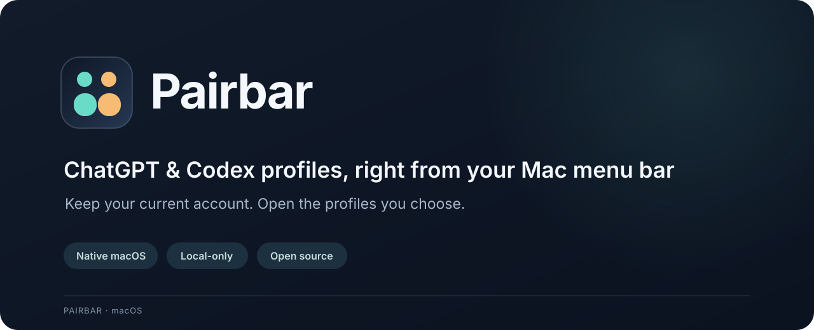
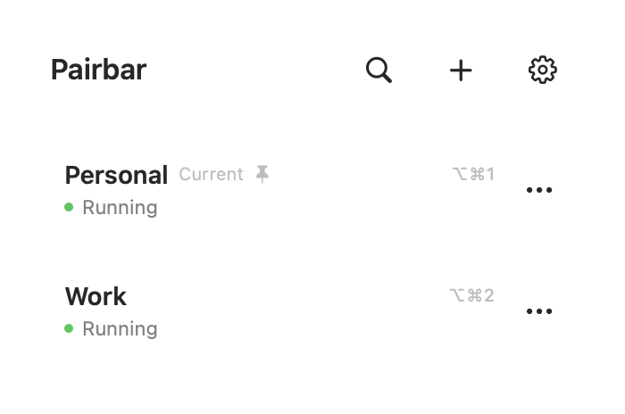
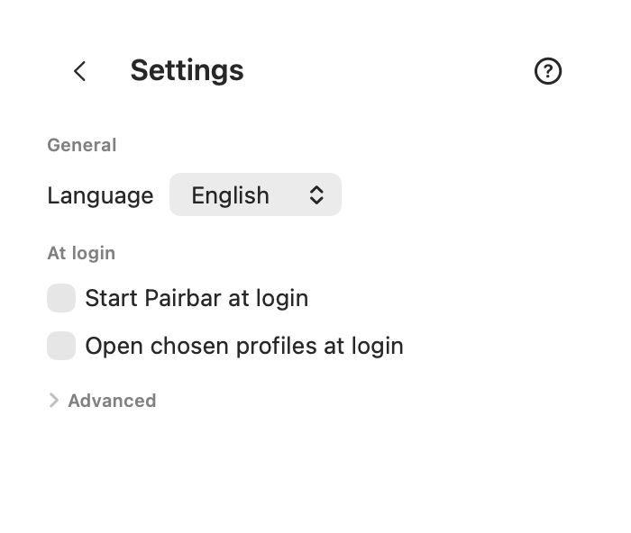
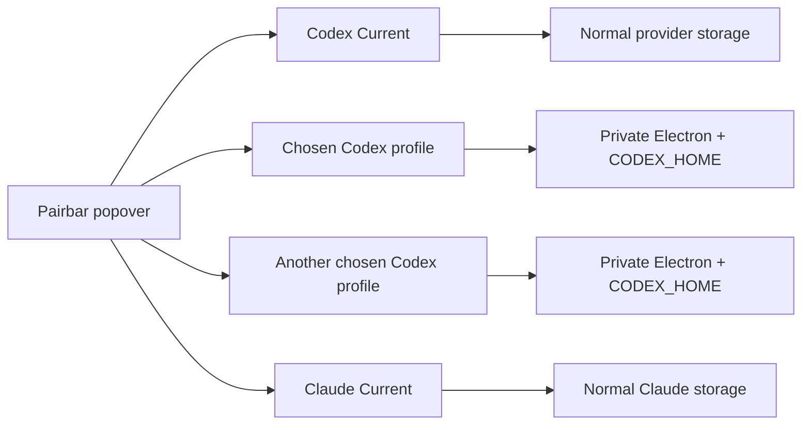

<p align="center">
  
</p>

# Pairbar

**ChatGPT &amp; Codex profiles, right from your Mac menu bar.**

Pairbar is a native macOS menu-bar app for keeping your usual account and opening only the additional ChatGPT or Codex profiles you choose. Profiles stay local on your Mac; Pairbar does not copy sessions or read credentials.

<p align="center">
  
  
</p>

Screenshots use Pairbar's inert preview and synthetic names. The preview does not open accounts, change login items, or control provider apps.

## Why Pairbar

- Keep the official app's **Current** account while saving the extra profiles you need.
- Open a profile or a chosen group from the native menu-bar popover.
- Keep profile data and preferences on your Mac, with no Pairbar networking or telemetry.
- Use search, favorites, filters, and optional keyboard shortcuts to reach profiles quickly.

**[Build](#build-and-try-it) · [User Guide](docs/USER_GUIDE.md) · [Security](SECURITY.md) · [Case Study](docs/CASE_STUDY.md)**

[](https://github.com/isaacstg/pairbar-codex/actions/workflows/ci.yml) [](#build-and-try-it) [](Package.swift) [](LICENSE)

Pairbar is independent and unofficial, with no affiliation with or endorsement from OpenAI or Anthropic.

## Everyday workflow

- Open or switch profiles from a simple list; use Search or Filter when needed.
- Keep frequently used profiles at the top with favorites.
- Open one profile, or select a specific group and open that group.
- New profiles receive the first free ⌥⌘ digit shortcut automatically when one is available; edit or clear it later.
- Opt individual profiles into opening at login only after enabling the separate global setting. Both settings are off by default.

Pairbar stays in a native popover. It has no permanent window and does not require a Dock icon. Profile creation, editing, ordering, shortcuts, lifecycle controls, diagnostics, recovery, export, and startup preferences remain inside the popover.

## Provider support

| Provider target | Current account | Additional managed profiles |
|---|---|---|
| ChatGPT/Codex | Opens or focuses the official app normally; Pairbar never closes, restarts, or resets it | Implemented with separate Electron storage and `CODEX_HOME`, compatibility approval, per-profile receipts, and conservative recovery |
| Claude.app | Opens or focuses the official app normally after verifying its official identity | **Disabled.** Static inspection is research evidence only; real Chat and Code isolation acceptance has not passed |
| Claude Cowork | Part of the normal Current app only | **Unvalidated.** Cloud, local VM, shared configuration, link routing, and credential boundaries still need explicit acceptance evidence |

“Current” is not a managed profile. It has no Pairbar storage directory or ownership receipt and never receives profile overrides. Pairbar will not use a managed process as Current when identity is uncertain.

## Safety properties

- **Verified ownership.** Managed lifecycle actions require a receipt matching profile, storage generation, PID, user, kernel start time, exact executable, provider identity, and expected private paths.
- **Conservative recovery.** Interrupted launches and unreadable or ambiguous processes block control. Pairbar never guesses ownership and never force-kills an app.
- **Durable intent.** Pairbar records a pending launch before asking LaunchServices to open a managed profile and clears it only after process and app-build checks succeed.
- **Recoverable removal.** Remove from Pairbar hides a managed profile from the active list and keeps its local storage at its original path; it can be restored from Settings → Removed Profiles.
- **Conservative archive/reset.** Archive and reset are separate safety-sensitive operations that require the provider state needed for a safe storage transition.
- **Opaque migration.** Existing Current + Second installations migrate their Pairbar metadata while the contents of `Profiles/b` remain unread. The historical Second storage path is retained.
- **Redacted output.** Diagnostics contain Pairbar state and bounded event codes. Configuration export contains labels and preferences, never paths, receipts, PIDs, fingerprints, journals, account data, or credentials.
- **No switcher networking.** Pairbar contains no network client, telemetry, updater, credential reader, token copier, Keychain access, or inspection of another process's arguments or environment.

This is profile separation within one macOS user, not an operating-system security boundary. The official apps and their upstream behavior determine whether profile overrides provide real session separation. Pairbar therefore treats static compatibility checks as necessary evidence, never as proof of account isolation.

## Development and release status

Pairbar is in active development; no public Developer ID-signed and notarized release is available yet. Managed Claude awaits real signed-in acceptance, and signed-in A/B account isolation remains pending. See [implementation status](docs/IMPLEMENTATION_STATUS.md) and the [public release checklist](docs/PUBLIC_RELEASE_CHECKLIST.md) for evidence and remaining release gates.

## Build and try it

You need macOS 13 or later, Xcode Command Line Tools with Swift 5.9 or later, and the official Electron-based `ChatGPT.app` with bundle identifier `com.openai.codex` for managed Codex profiles. The optional Claude Current integration expects the official `Claude.app` with bundle identifier `com.anthropic.claudefordesktop` and Team ID `Q6L2SF6YDW`.

```sh
git clone https://github.com/isaacstg/pairbar-codex.git
cd pairbar-codex
python3 scripts/audit.py
swift test
bash scripts/build.sh
```

Use a regular checkout location such as your home directory. Filesystem tests deliberately reject macOS symlink aliases such as `/tmp` and `/var`. The build script creates `dist/Pairbar.zip`; local archives are ad-hoc signed and must not be described as notarized releases. Do not disable Gatekeeper globally.

When upgrading from Codex Account Switcher or Pairbar 1.3.3, keep the existing application-support directory. Pairbar migrates switcher-owned metadata and preserves the legacy Second directory without reading the profile inside it. Review the in-app migration/recovery state before opening a managed profile.

## How managed Codex profiles work


```mermaid
flowchart LR
    P[Pairbar popover] --> CC[Codex Current]
    P --> C1[Chosen Codex profile]
    P --> C2[Another chosen Codex profile]
    P --> CL[Claude Current]
    CC --> D[Normal provider storage]
    CL --> D2[Normal Claude storage]
    C1 --> I1[Private Electron + CODEX_HOME]
    C2 --> I2[Private Electron + CODEX_HOME]
```

Pairbar explicitly supplies `--user-data-dir`, `CODEX_ELECTRON_USER_DATA_PATH`, and `CODEX_HOME` for a chosen managed Codex profile. LaunchServices environment inheritance is not a sufficient boundary between instances. At startup, Pairbar captures an immutable Codex Current context and removes inherited values under its own `Profiles` tree from Pairbar's environment. Every new Codex Current launch explicitly supplies both sensitive paths: external custom paths are preserved exactly; missing or contaminated values use ordinary Current defaults. Current keeps empty launch arguments and receives no managed storage or receipt. Saved profiles consume metadata and storage but are not assumed to be simultaneously runnable; practical concurrency depends on memory and on the official app.

Before launch, Pairbar saves a profile-specific pending marker. After launch it verifies the returned process, saves a receipt, rechecks the approved app fingerprint, and then clears pending state. Any unreadable identity or mismatched state blocks focus, close, restart, archive, and recovery as appropriate.

Read the [security model](SECURITY.md) and [Claude acceptance protocol](docs/CLAUDE_ACCEPTANCE.md) for the exact boundaries.

## Repository structure

| Layer | Responsibility |
|---|---|
| `SwitcherCore/Dynamic` | Dynamic provider/profile model, schema-3 metadata, migration, receipts, state resolution, archive journal |
| `SwitcherCore/Providers/Claude` | Read-only static inspection and an explicit unsupported capability result for managed Claude profiles |
| AppKit / SwiftUI | Native popover, search, filters, favorites, configurable shortcuts, login choices, local feedback |
| Runtime controller | LaunchServices, process observations, ownership checks, memory pressure, and lifecycle orchestration |
| Tests and audit | Pure state/storage/compatibility tests, fake-runtime integration checks, source-policy guard, and packaging checks |

At the post-PR #7 baseline (`55b704c`), the source passed 168 Swift tests, including Restart approval/cancellation, ownership and persistence failures, one-prompt Open Selected behavior, and inert preview settings. The source-policy audit, diff/plist/shell checks, universal release compilation, ZIP extraction, and strict all-architectures signature verification also passed. The historical PR #4 Pairbar 2.0.0 (17) archive contained `x86_64` and `arm64` and was ad-hoc signed with hardened runtime. It was not Developer ID signed or notarized.

The inert native preview was inspected in English and Spanish without constructing a controller, registering shortcuts, changing system login items, or touching provider apps. The first Search click and Command-F from collapsed search focused the field and accepted immediate typing. Profiles, Add/Edit profile, Filter, Select/Done, Settings, Advanced, Help, and Welcome were checked in the native UI. The screenshots above were refreshed with synthetic names in light and dark appearance; the Mac's original dark setting was restored. An earlier installed-app pass exercised full keyboard traversal and exposed labeled controls through VoiceOver. Human confirmation of VoiceOver announcements is still required.

Read-only checks outside the task sandbox verified the installed ChatGPT `26.917.62051 (10789)` and Claude `1.34493.1` bundles. Pairbar's own compatibility checks passed for both; Claude's strict signature and Gatekeeper checks passed (`Notarized Developer ID`). Earlier failures were sandbox false negatives: the restricted process could not reach the system trust store. No official bundle was changed. The simplified UI was inspected in an inert native preview in light and dark modes; live profile creation and signed-in account separation still require acceptance without disturbing existing user accounts.

## Contributing

Read [CONTRIBUTING.md](CONTRIBUTING.md) before changing security-sensitive behavior. Report reproducible bugs through [GitHub issues](https://github.com/isaacstg/pairbar-codex/issues/new?template=bug_report.yml) and use [private vulnerability reporting](https://github.com/isaacstg/pairbar-codex/security/advisories/new) for security issues. Never include account data or credentials.

## Credits and license

Created by **[Isaac · isaacstg](https://github.com/isaacstg)**. The implementation is independent. Existing account switchers were studied for product patterns; reused code must be separately identified and attributed.

**MIT** · [License](LICENSE) · [Changelog](CHANGELOG.md)
