# Pairbar account state machine

This document describes the policy implemented by `Dynamic/StateResolver.swift` and enforced again by `PairbarController.swift`. Pairbar derives no role from logins, cookies, Keychain items, process arguments, or process environments. It uses the official-app process set plus metadata and receipts that Pairbar created.

## Current

Each provider has one ordinary Current entry. Current uses the provider's default storage, has no Pairbar profile record or receipt, and is discovery, normal open, and focus only.

```mermaid
stateDiagram-v2
    [*] --> Stopped
    Stopped --> Launching: open normally
    Launching --> Running: exactly one verified default candidate
    Launching --> Blocked: ownership becomes uncertain
    Running --> Stopped: process exits
    Stopped --> Running: one default candidate appears
    Running --> Ambiguous: several default candidates appear
    Ambiguous --> Running: exactly one candidate remains
    Stopped --> Blocked: managed ownership is uncertain
    Running --> Blocked: managed ownership is uncertain
    Ambiguous --> Blocked: managed ownership is uncertain
    Blocked --> Stopped: recovery succeeds; no candidate
    Blocked --> Running: recovery succeeds; one candidate
```

Default candidates are verified official processes minus only those excluded by exact managed-profile ownership. Pairbar never guesses:

- zero candidates means `stopped`;
- one candidate may be focused as `running`;
- more than one is `ambiguous`;
- any pending, unreadable, reused, duplicate, or otherwise uncertain managed identity blocks Current classification.

No Current state grants close, restart, archive, reset, or recovery authority.

## Managed Codex profile

Every saved managed Codex profile has an immutable storage locator and generation. It receives its own Electron directory and `CODEX_HOME`. Saved profile count is not capped; live concurrency remains limited by the Mac and the official app.

```mermaid
stateDiagram-v2
    [*] --> Stopped
    Stopped --> Launching: compatibility approved; pending intent persisted
    Launching --> RunningVerified: new process adopted; receipt saved; build rechecked
    Launching --> OwnershipUncertain: launch or post-launch verification fails
    RunningVerified --> Quitting: graceful close requested
    Quitting --> Stopped: exact process exits; receipt cleared
    Quitting --> RunningVerified: graceful close times out
    RunningVerified --> OwnershipUncertain: receipt or live identity no longer matches
    RunningVerified --> Stopped: exact receipt process is absent
    OwnershipUncertain --> RunningVerified: conservative recovery proves receipt and build
    OwnershipUncertain --> Stopped: provider is quiescent; metadata safely cleared
```

Before LaunchServices opens a managed profile, Pairbar:

1. verifies the official app and approved build fingerprint;
2. re-resolves all provider ownership after asynchronous inspection;
3. prepares only that profile's validated private paths;
4. persists a pending launch marker;
5. requires a new PID with matching UID, kernel start time, executable, app identity, launch time, and expected path policy;
6. persists a profile-specific receipt and rechecks the app build before clearing pending state.

An unreadable or mismatched observation fails closed. Pairbar never force-quits a process. Critical memory pressure pauses launches that would add an instance; focusing a verified existing process remains safe.

Managed Claude profiles remain unavailable. Residual Claude metadata can be decoded for safe migration and denial, but cannot launch, close, restart, archive, reset, or block supported Codex login selections.

## Action policy

| Target state | Open/focus | Graceful close/restart | Archive/reset |
|---|---|---|---|
| Current stopped or verified running | Yes, after official identity check | Never | Never |
| Current ambiguous or blocked | No | Never | Never |
| Managed Codex stopped and provider clean | Launch after approved compatibility | No | Only when the whole provider is quiescent |
| Managed Codex running with exact ownership | Focus | Yes | No |
| Managed launching or quitting | No duplicate action | No competing action | No |
| Managed ownership uncertain | No | No | No; recover first |
| Managed Claude | No | No | No |

Provider-level exclusion serializes operations that could otherwise race. Batch and login launches enumerate concrete selected targets; Pairbar has no implicit “open every saved profile” path.

## Recovery, archive, and reset

Recovery may restore a live receipt only when exact ownership and the already-approved build remain valid. Otherwise every official process for that provider must be closed before uncertain metadata can be cleared.

Archive and reset require fresh provider-quiescence evidence, no receipt or pending launch, no unexplained storage, and no competing archive journal. Pairbar journals the transition, renames the opaque profile directory into `Profiles/Archived/`, syncs both parents, commits metadata, then removes the journal. It never reads or immediately deletes the archived provider contents. Reset assigns a new storage locator and generation; archive marks the profile unavailable.
